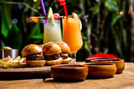

# FoodAndDrinks
## TEAM
1.Wiktoria Świątkowska- WiktoriaSwiatkowska- 1,4,5 2. Wiktoria Żełubowska- WiktoriaZelubowska- 2,3,6
### INTRODUCTION
Food is any substance consumed by an organism for nutritional support. Food is usually of plant, animal, or fungal origin and contains essential nutrients such as carbohydrates, fats, proteins, vitamins, or minerals. The substance is ingested by an organism and assimilated by the organism's cells to provide energy, maintain life, or support growth. Different species of animals have different feeding behaviours that satisfy the needs of their metabolisms and have evolved to fill specific ecological niches within specific geographical contexts.Omnivorous humans are highly adaptable and have adapted to obtaining food in many different ecosystems. Humans generally use cooking to prepare food for consumption. The majority of the food energy required is supplied by the industrial food industry, which produces food through intensive agriculture and distributes it through complex food processing and food distribution systems. This system of conventional agriculture relies heavily on fossil fuels, which means that the food and agricultural systems are one of the major contributors to climate change, accounting for as much as 37% of total greenhouse gas emissions.[1] 
Food is any substance consumed to provide nutritional support and energy to an organism.[2][3] It can be raw, processed, or formulated and is consumed orally by animals for growth, health, or pleasure. Food is mainly composed of water, lipids, proteins, and carbohydrates. Other organic substances (e.g., vitamins) and minerals (e.g., salts) can also be found in food.[4] Plants, algae, and some microorganisms use photosynthesis to make some of their own nutrients.[5] Water is found in nearly all foods and has been defined as food by itself.[6] Water has no food energy, and fibers have low energy densities, or food energy relative to volume, some providing none, while fat is the most energy-dense component.[3] Some inorganic substances are also essential for plant and animal functioning.[7]
A drink or beverage is a liquid intended for human consumption. In addition to their basic function of satisfying thirst, drinks play important roles in human culture. Common types of drinks include plain drinking water, milk, juice, smoothies and soft drinks. Traditionally warm beverages encompass coffee, tea, and hot chocolate. Caffeinated drinks that contain the stimulant caffeine, have been consumed for centuries.[2]In addition, alcoholic drinks such as wine, beer, and liquor, which contain the psychoactive substance ethanol, have been part of human culture for more than 8,000 years. Non-alcoholic drinks typically refer to beverages that are traditionally alcoholic—such as beer, wine, or cocktails—but are produced with a very low alcohol by volume content. This category includes beverages that have undergone processes to remove or significantly reduce alcohol, such as non-alcoholic beers and de-alcoholized wines. 
## DATA

Below are images showing food and drinks.  
Two come from the Internet, and one is saved locally in the project folder.

